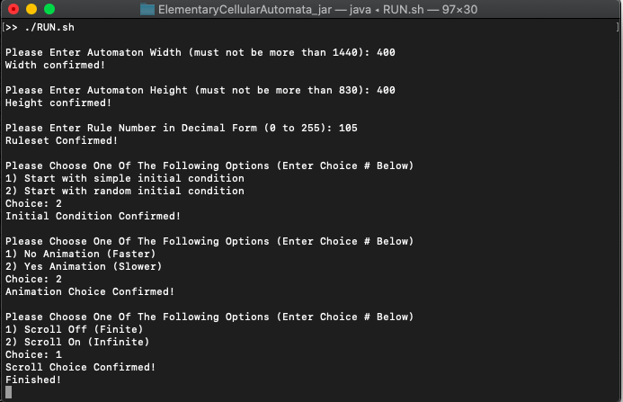
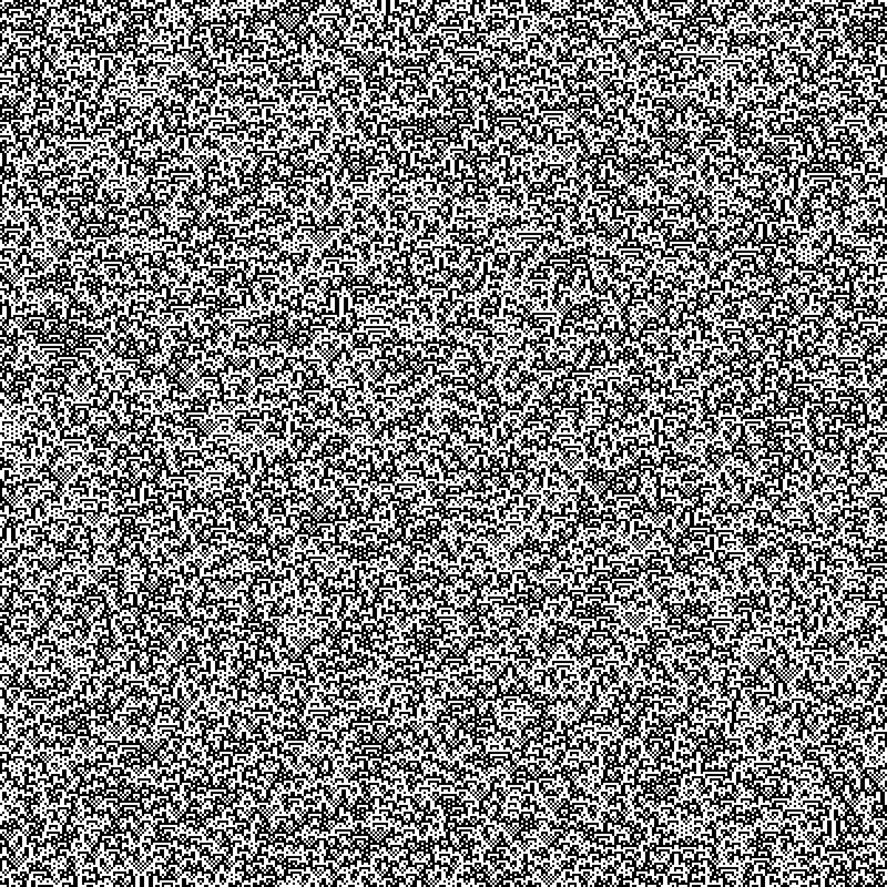

# ElementaryCellularAutomata
Java project to simulate elementary (1D) cellular automata

## Installation
Note: You need to have Java installed on your computer

Option 1: Copy the repository. Navigate to 
`ElementaryCellularAutomata/out/artifacts/ElementaryCellularAutomata_jar` to find important executables

Option 2: Download the folder containing only the important executables from my google drive:
https://drive.google.com/drive/folders/1AZwU18H_s1bb04KjTSPvqd2lI6VQf-fl?usp=sharing

## Usage
Run this command from the folder containing the .jar file: `java -jar ElementaryCellularAutomata.jar`

Optionally:

On Windows: run the executable `RUN.bat` from the folder containing the .jar file

On Mac: run the executable `RUN.sh` from terminal in the folder containing the .jar file

The program will start in terminal and walk the user through several prompts before generating the automaton simulation

  
## Example
Based on various input for rulesets and for simple versus random initial states, there are a huge variety of cellular automata possible

Below is a static image of Rule 105 with random initial state

Below is a gif showing Rule 18 with simple initial state and animation and scroll enabled

## Authors

David Kohler

## License

This project is licensed under the MIT License - see the LICENSE.md file for details 
